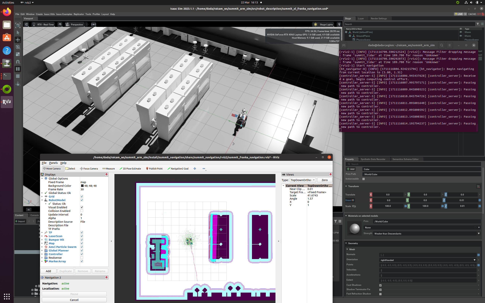
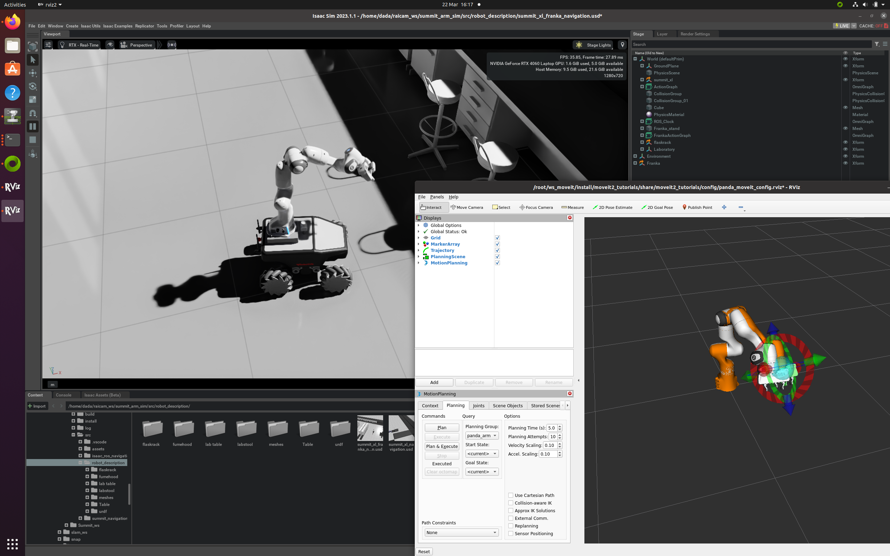
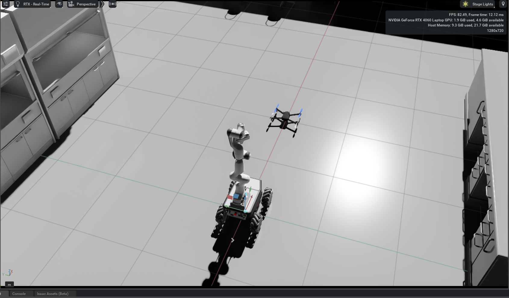
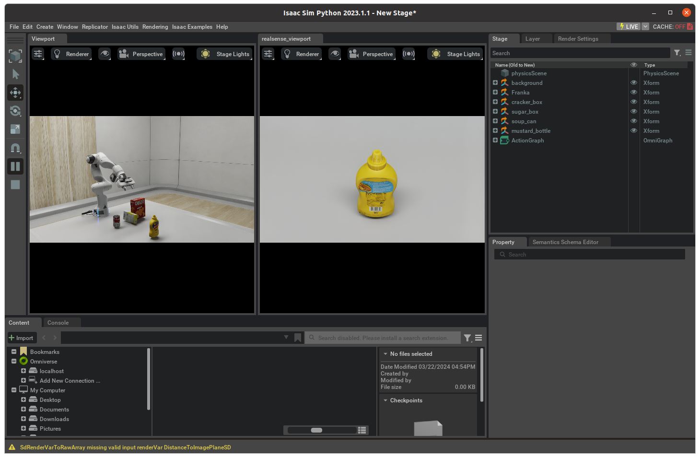

# summit_arm_drone - Simulation Design of a Robotic Mobile Manipulator with Drone in Isaacsim.
Isaacsim ros2 simulation and control for Summit mobile platform and robot arms





## Thanks

This simulation env is made with aspirations from following open-source repositories. Credits should go to the respective creators.

- [Summit_ws](https://github.com/debi-ml/Summit_ws)
- [isaacsim_ros2_drone](https://github.com/SasaKuruppuarachchi/isaacsim_ros2_drone)


## Description

This repository is part of the first sprint of [RAICAM](raicam.eu). Which is to create a Isaacsim Environment for a mobile robot platform with a robot arm, together with a drone.

The repository contains the necessary code, configurations, and documentation to set up and run the robotic system in the simulated environment. The codebase includes modules for performing navigation tasks, and executing motion planning and trajectory generation.

Also, this repository do not need to use a docker of isaacsim, which needs [Nvidia NGC](https://ngc.nvidia.com) service. So, chill if you don't have an ngc api key. You only need to use omniverse launcher to install Isaacsim.

## Table of Contents

- [Installation](#installation)
- [Usage](#usage)
- [Features](#features)

## Installation

1. Install [Isaac Sim](https://docs.omniverse.nvidia.com/app_isaacsim/app_isaacsim/install_workstation.html#isaac-sim-app-install-workstation) by following the installation instructions provided in the official documentation.

2. Install [ROS2](https://docs.ros.org/) that fits your system by following the installation instructions provided in the official documentation.

3. Install [nav2](https://navigation.ros.org/getting_started/index.html) by following the installation instructions provided in the official documentation.

4. Install [Docker](https://example.com) by following the installation instructions provided in the official documentation.

5. Clone the repository:

   ```shell
   git clone https://github.com/RAICAM-EU-Project/summit_arm_drone.git
   ```

6. Build your packages:

   ```shell
   cd summit_arm_drone
   colcon build
   ```
7. Install and build a Ubuntu 22.04 Humble based Docker image with Moveit2.
   ```shell
   cd ~
   mkdir moveit_ws && cd moveit_ws
   git clone https://github.com/ros-planning/moveit2_tutorials.git -b main
   cd moveit2_tutorials/doc/how_to_guides/isaac_panda
   sudo docker compose build base
   ```
   This docker image also contains pytorch.

8. Running the MoveIt Interactive Marker Demo with Isaac Sim

   a. On the host computer, go to the tutorials launch directory.
   ```shell
   cd moveit2_tutorials/doc/how_to_guides/isaac_panda/launch
   ```

   b. Then run the following command to load the Panda Robot pre-configured to work with this tutorial.
   ```shell
   ./python.sh isaac_moveit.py
   ```
   Note: This step assumes that a compatible version of Isaac Sim is installed on the host in the $HOME/.local/share/ov/pkg/" directory. This step also takes a few minutes to download the assets and setup Isaac Sim so please be patient and don’t click the Force Quit dialog that pops up while the simulator starts.

   Debug 1. If you meet "rclpy can not load" problem, try go /opt/ros/<your-ros-distro>/lib/python3.8/site-packages/rclpy and copy the relative .so lib to correct version, eg. python3.8 -> python3.10.

   Debug 2. If you meet "Could not load the dynamic library from libomni.isaac.ros2_bridge.foxy.so. Error: libvision_msgs__rosidl_typesupport_c.so: cannot open shared object file" problem, try "sudo apt install ros-<your-ros-distro>-vision-msgs"

   If it works well and you got your isaacsim like this:
   
   That means you have successfully done it. 

9. From the moveit2_tutorials/doc/how_to_guides/isaac_panda directory start a container that connects to Isaac Sim using the topic_based_ros2_control/TopicBasedSystem hardware interface.
   ```shell
   docker compose up demo_isaac
   ```
   Now you can control your arm with moveit. You can play it and see the result on the isaacsim app. Then you can close isaacsim app.

10. Run the Docker container and run the terminal using the following command:

   ```shell
   docker exec -it isaac_panda-demo_isaac-1 bash
   ```

11. Inside the Docker container, clone and build the forked and modified `pymoveit2` repository for sending the motion commands for the robot arm using the python scripts:

   ```shell
   cd ..
   git clone https://github.com/mld95/pymoveit2.git
   cd pymoveit2
   colcon build
   ```

12. Download Pegasus Simulator extention for the drone.
   ```shell
   cd ~
   git clone https://github.com/PegasusSimulator/PegasusSimulator.git
   ```

13. Launch Isaacsim and enable the Pegasus Simulator extention, you can refer to Sasanka's [isaacsim_ros2_drone](https://github.com/SasaKuruppuarachchi/isaacsim_ros2_drone) repo.


## Usage

1. Launch the simulation environment by opening the following .usd file in the Isaac Sim:
`src/robot_description/summit_xl_franka_navigation.usd`

2. Start the autonomous navigation:

   ```shell
   ros2 launch summit_navigation summit_franka_navigation.launch.py
   ```
3. To send the navigation goals programatictly which are defined in `src/isaac_ros_navigation_goal/assets/goals.txt` run the following command:

   ```shell
   ros2 launch isaac_ros_navigation_goal isaac_ros_navigation_goal.launch.py
   ```

4. To control the robot arm using Moveit2 start the docker container: 

   ```shell
   docker compose up demo_isaac
   ```
5. To send commands for the robot arm programaticlly open a terminal in a docker container:

   ```shell
   docker exec -it isaac_panda-demo_isaac-1 bash
   ```
6. Source the pymoveit2 package and run one of the examples:

   ```shell
   cd ~/pymoveit2
   source install/local_setup.bash
   ros2 run pymoveit2 grasp_test.py
   ```

7. To work together with the drone, open the following .usd file in the Isaac Sim: `src/robot_description/summit_xl_franka_drone.usd`


## Features

- Utilizes the Isaac Sim simulation tool and ROS framework for controlling and simulating robotic systems.
- Implements an omnidirectional mobile manipulator composed of a Summit XL mobile platform and a Franka Emika Panda robot arm.
- Incorporates the Navigation Stack 2 for autonomous navigation and the Moveit2 platform for motion planning and trajectory execution.
- Provides a testing environment to gain insights into the system's workflow and identify areas for improvement.
- Integrate also the drone to the Isaacsim env.

